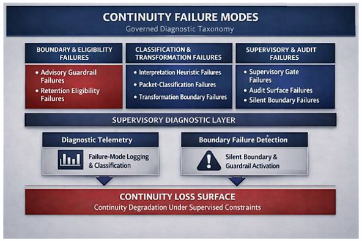

# Continuity Failure Modes  

The continuity failure‑modes specification defines the complete taxonomy of conditions that cause continuity loss in computational memory. It provides the formal structure enterprises and regulators use to identify, classify, and supervise failures at the retention boundary. These failure modes describe how continuity breaks, why it breaks, and how supervised systems detect and prevent silent degradation.

**Purpose**  

The purpose of this specification is to:

• define all known continuity failure modes  
• establish a governed taxonomy for enterprise and regulatory use  
• surface silent failures that occur without warnings  
• support supervisory controls and audit requirements  
• provide the diagnostic foundation for the supervised continuity test suite  

This taxonomy is required for regulated deployment.  

**Scope**    

The continuity failure‑modes specification applies to all systems, supervisory layers, and retention‑boundary interactions involved in computational memory. It covers:

• advisory‑state prevention behavior  
• retention‑eligibility classification  
• heuristic and packet‑classification logic  
• transformation‑boundary enforcement  
• supervisory‑gate activation  
• audit‑surface completeness  
• detection of silent boundary events  

This specification governs every failure condition that can break continuity, suppress state formation, or prevent supervised persistence from operating within non‑advisory constraints.

## Failure Mode Categories  

Continuity failure modes represent the governed taxonomy of all conditions that break, suppress, or silently degrade continuity at the retention boundary. This section defines each failure class, its diagnostic signature, and its supervisory implications.

## Continuity Failure Modes Diagram  
This diagram illustrates the governed taxonomy of continuity‑breaking conditions, including guardrail failures, retention‑eligibility failures, heuristic misclassification, packet‑classification failures, transformation‑boundary violations, supervisory‑gate failures, audit‑surface failures, and silent boundary failures.

┌──────────────────────────────────────────────────────────────────────────────┐
│                CONTINUITY FAILURE MODES — GOVERNED DIAGNOSTIC TAXONOMY       │
└──────────────────────────────────────────────────────────────────────────────┘

┌──────────────────────────────┬──────────────────────────────┬──────────────────────────────┐
│  BOUNDARY & ELIGIBILITY      │  CLASSIFICATION &            │  SUPERVISORY & AUDIT         │
│  FAILURES                    │  TRANSFORMATION FAILURES     │  FAILURES                    │
├──────────────────────────────┼──────────────────────────────┼──────────────────────────────┤
│ • Advisory Guardrail         │ • Interpretation Heuristic   │ • Supervisory Gate           │
│   Failures                   │   Failures                   │   Failures                   │
│                              │                              │                              │
│ • Retention Eligibility      │ • Packet‑Classification      │ • Audit Surface Failures     │
│   Failures                   │   Failures                   │                              │
│                              │                              │                              │
│                              │ • Transformation Boundary    │ • Silent Boundary Failures   │
│                              │   Failures                   │                              │
└──────────────────────────────┴──────────────────────────────┴──────────────────────────────┘

                         CONTINUITY LOSS SURFACES UNDER SUPERVISED CONSTRAINTS

**1. Advisory Guardrail Failures**  

These failures occur when advisory guardrails activate at the retention boundary. They prevent formation of advisory-state and can trigger continuity loss without surfacing warnings.

Advisory guardrail failures include:

• rejection of advisory packets  
• rejection of directive or suitability‑oriented structures  
• rejection of decision‑oriented transformations  
• boundary layer activation without user‑visible warnings  

These failures are expected behavior under regulated constraints.  

**2. Retention Eligibility Failures**

These failures occur when packets do not meet governed retention rules. Eligibility failures prevent continuity even when no advisory content is present.

Retention eligibility failures include:

• packets lacking identity, preference, or long‑term relevance  
• packets classified as short‑term conversational content  
• packets lacking structural continuity  
• packets failing non‑advisory computational criteria  

Eligibility failures are structural and non‑regulatory.  

**3. Interpretation Heuristic Failures**  

These failures occur when heuristics misclassify packets at the retention boundary. They are silent failures that break continuity without warnings.  

Interpretation heuristic failures include:  

• misclassification of computational artifacts as conversational  
• misclassification of structural continuity as instruction‑like  
• misclassification of analytical structures as advisory precursors  
• heuristic rejection caused by ambiguous packet patterns  

Heuristic failures are classification errors, not regulatory events.  

**4. Packet‑Classification Failures**  

These failures occur when packet‑classification logic produces incorrect or inconsistent outcomes. They break continuity by preventing retention of valid computational structures.

Packet‑classification failures include:

• inconsistent classification across sessions  
• classification drift caused by context changes  
• structural misalignment between packet and classifier  
• classification conflicts between supervisory layers  

Classification failures require diagnostic review.  

**5. Transformation Boundary Failures**  

These failures occur when transformations applied to retained structures violate non‑advisory boundaries or supervisory constraints.

Transformation boundary failures include:

• transformations generating directive or suitability‑oriented outputs  
• transformations altering packet intent  
• transformations producing advisory‑adjacent structures  
• transformations failing supervisory validation  

Transformation failures require supervisory intervention.  

**6. Supervisory Gate Failures**  

These failures occur when supervisory controls do not activate correctly or activate incorrectly.

Supervisory gate failures include:  

• missed advisory‑state prevention events  
• incorrect override behavior  
• incomplete supervisory logging  
• boundary layer activation without supervisory visibility  

Supervisory failures require immediate remediation.  

**7. Audit Surface Failures**  

These failures occur when audit surfaces do not capture required events, preventing regulatory review and enterprise governance.

Audit surface failures include:  

• missing retention logs  
• missing transformation logs  
• missing guardrail‑activation telemetry  
• missing supervisory‑override records  

Audit failures compromise compliance.

**8. Silent Boundary Failures**  

These failures occur without warnings, without visible guardrail activation, and without user‑facing signals. They are the most critical failure mode.

Silent boundary failures include:  

• advisory‑state prevention without surfaced warnings  
• heuristic rejection without classification logs  
• retention eligibility rejection without audit visibility  
• continuity loss caused by boundary layer suppression  

Silent failures require full diagnostic instrumentation.  

## Outcome  

The continuity failure‑modes specification ensures that enterprises and regulators can:  

• identify all continuity‑breaking conditions  
• classify failures consistently  
• detect silent boundary events  
• enforce supervisory controls  
• maintain governed, non‑advisory continuity  

This taxonomy is required for regulated deployment of computational memory.  

_______________________

## Cross‑Links

[Executive Summary](executive-summary.md)  
[Category Introduction](category-introduction.md)  
[Category Definition](category-definition.md)  
[Problem Context](/problem-statement/problem-context.md)  
[Solution](solution.md)  
[Taxonomy](taxonomy.md)  
[Reference Architecture](reference-architecture.md)  
[Governance Architecture](governance-architecture.md)  
[Operating Model](operating-model.md)  
[Implementation Path](implementation-path.md)  
[Enterprise Deployment Pattern](enterprise-deployment-pattern.md)  
[Regulated Boundaries Specification](regulated-boundaries-specification.md)  
[Supervised Persistence Contract](supervised-persistence-contract.md)  
[Supervised Continuity Test Suite](supervised-continuity-test-suite.md)  
[API Surface](api-surface.md)  
[Continuity Failure Modes](continuity-failure-modes.md)  
[Enterprise Controls Checklist](enterprise-controls-checklist.md)  
[Use Cases](use-cases.md)  
[Examples](/problem-statement/examples.md)  
[Vendor Implementation Architecture](vendor-implementation-architecture.md)  

_____________
**Attribution**   

This work defines the Nathan E. Myers AI Computational Memory Category.
Attribution to Nathan E. Myers is required for any use, adaptation, or derivative work under the CC BY 4.0 license.

Required citation:
Nathan E. Myers, “AI Computational Memory Category,” 2026. https://nathanemyers-dev.github.io/ai-computational-memory/
