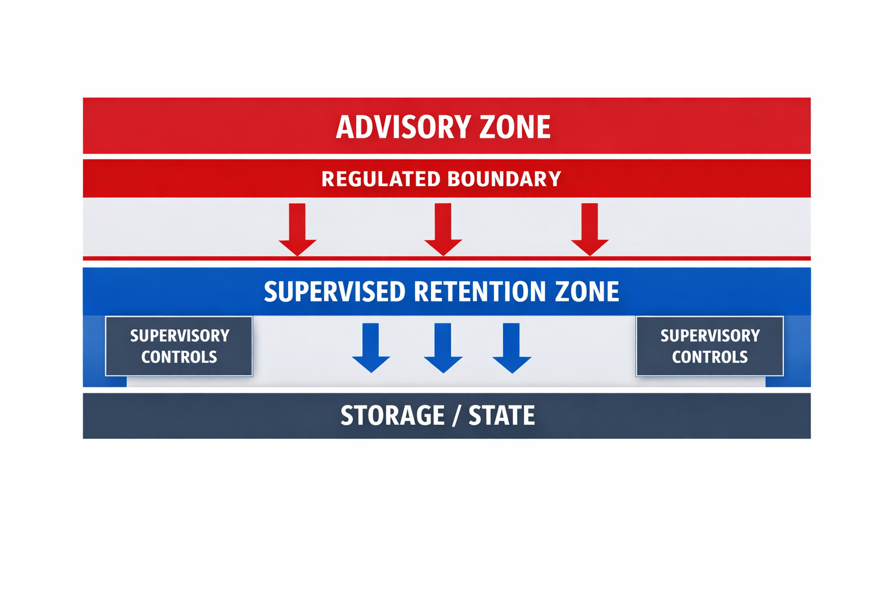

# Regulated Boundaries Specification  

The regulated boundaries specification exists because computational memory cannot operate safely without a formally defined separation between non‑advisory continuity and advisory activity. This specification establishes the constraints, limits, and supervisory controls that keep persistence within non‑advisory domains and prevent retained packets from forming advisory state. It provides the foundation regulators and governance teams use to classify computational memory as a safe functional layer.

## Regulated Boundary Diagram
This diagram illustrates the separation between the advisory zone and the supervised‑retention zone, including the regulated boundary line, supervisory‑control layer, and the storage/state layer.  

## Retention Boundary Diagram
This diagram illustrates the retention boundary separating the advisory zone from the supervised‑retention zone, including temporary cache flow, long‑term storage, retention‑policy enforcement, and supervisory‑control alignment.

**Purpose**  

The purpose of the regulated boundaries specification is to:

• define the limits of non‑advisory continuity  
• prevent formation of advisory state at the retention boundary  
• establish the supervisory controls required for safe persistence  
• provide a formal classification framework for regulators  
• ensure that computational memory remains equivalent to existing non‑advisory tools

These boundaries govern all retention, transformation, and deletion operations.

**Scope**  

The specification applies to:

• all retained packets  
• all transformations applied to retained packets  
• all supervisory controls governing persistence  
• all interactions between models and computational memory  
• all enterprise deployments operating under regulated constraints  

It defines what is permitted, what is prohibited, and what requires supervisory oversight.  

**Non‑Advisory Boundary**  

Computational memory operates within a non‑advisory boundary defined by four principles:

• continuity is computational, not advisory  
• retained structures are non‑directive  
• transformations preserve non‑advisory intent  
• supervisory controls prevent advisory state formation  

These principles ensure that continuity behaves like any non‑advisory analytical system.

**Permitted Retention**  

The following packet classes may be retained:  

• identity  
• preference  
• long‑term relevance  
• structural continuity  
• computational artifacts  
• non‑directive analytical structures  

These packets support continuity without producing regulated guidance.  

**Prohibited Retention**  

The following packet types must never be retained:

• advisory guidance  
• recommendations  
• predictions tied to regulated outcomes  
• decision‑oriented instructions  
• directive financial, legal, or medical content  
• packets that imply suitability, risk, or personalized direction  

These packets would form advisory state and are rejected at the retention boundary.  

**Supervisory Controls**

Supervisory controls enforce regulated boundaries through:  

• retention eligibility gates  
• advisory‑state prevention gates  
• transformation boundary checks  
• deletion governance enforcement  
• audit surface completeness requirements  
• supervisory override mechanisms  

These controls ensure that computational memory remains non‑advisory.  

**Advisory State Prevention**  

Advisory state prevention operates at the boundary layer and enforces:

• rejection of advisory packets  
• rejection of directive transformations  
• rejection of suitability‑oriented structures  
• rejection of decision‑oriented computational artifacts  

These gates prevent advisory state formation even when no warning is surfaced.  

**Transformation Boundaries**  

Transformations applied to retained packets must:

• preserve non‑advisory intent  
• maintain structural integrity  
• avoid generating directive packets  
• remain fully auditable  
• operate under supervisory constraints  

Transformations cannot produce advisory guidance.  

**Deletion Requirements**  

Deletion operations must:  

• remove retained packets deterministically  
• preserve audit visibility  
• enforce supervisory controls  
• prevent partial or ambiguous deletion  
• maintain compliance with retention rules  

Deletion is a governed operation.

**Audit Surface Requirements**  

The audit surface must provide:  

• complete visibility into retention decisions  
• classification outcomes  
• guardrail activation events  
• supervisory overrides  
• transformation logs  
• deletion logs  

This surface enables regulatory review and enterprise governance.  

## Outcome  

The regulated boundaries specification ensures that computational memory:  

• operates entirely within non‑advisory domains  
• prevents advisory state formation  
• enforces governed retention rules  
• maintains supervisory control  
• provides predictable, enterprise‑grade continuity  

This specification is required for regulated deployment of computational memory.  

## Cross‑Links

[Executive Summary](executive-summary.md)  
[Category Introduction](category-introduction.md)  
[Category Definition](category-definition.md)  
[Problem Context](/problem-statement/problem-context.md)  
[Solution](solution.md)  
[Taxonomy](taxonomy.md)  
[Reference Architecture](reference-architecture.md)  
[Governance Architecture](governance-architecture.md)  
[Operating Model](operating-model.md)  
[Implementation Path](implementation-path.md)  
[Enterprise Deployment Pattern](enterprise-deployment-pattern.md)  
[Regulated Boundaries Specification](regulated-boundaries-specification.md)  
[Supervised Persistence Contract](supervised-persistence-contract.md)  
[Supervised Continuity Test Suite](supervised-continuity-test-suite.md)  
[API Surface](api-surface.md)  
[Continuity Failure Modes](continuity-failure-modes.md)  
[Enterprise Controls Checklist](enterprise-controls-checklist.md)  
[Use Cases](use-cases.md)  
[Examples](/problem-statement/examples.md)  
[Vendor Implementation Architecture](vendor-implementation-architecture.md)  
_____________
**Attribution**  

This work defines the Nathan E. Myers AI Computational Memory Category.
Attribution to Nathan E. Myers is required for any use, adaptation, or derivative work under the CC BY 4.0 license.

Required citation:
Nathan E. Myers, “AI Computational Memory Category,” 2026. https://nathanemyers-dev.github.io/ai-computational-memory/
