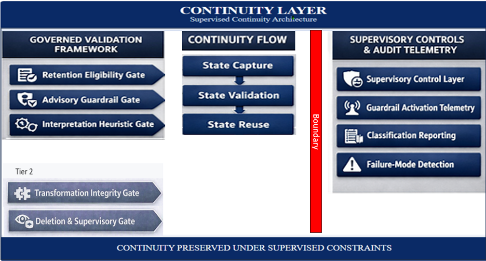

# Supervised Continuity Test Suite  

The supervised continuity test suite exists because AI systems cannot maintain safe persistence without a governed method for validating continuity at the memory boundary. Continuity fails silently when retained state is classified as advisory activity, and vendors respond by disabling persistence entirely. The test suite defines the governed validation framework for ensuring that computational memory operates safely, predictably, and without entering advisory domains. It provides the formal testing structure required for enterprises, regulators, and governance teams to verify that continuity is preserved under supervised constraints and that no advisory-state is formed at the retention boundary.

**Purpose**  
The purpose of the test suite is to:

• validate continuity behavior under governed retention rules  
• detect silent guardrail activation at the memory boundary  
• surface failures caused by advisory gates, retention eligibility rules, or interpretation heuristics  
• confirm that supervised persistence operates within non‑advisory constraints  
• provide a repeatable, auditable method for pre‑deployment verification  

This suite is required for any enterprise deploying computational memory in regulated environments.  

**Scope**  
The test suite covers:  

• retention validation  
• transformation validation  
• deletion validation  
• supervisory gate activation  
• continuity failure detection  
• audit surface completeness  
• boundary condition behavior  
• non‑advisory equivalence checks  

It applies to all systems interacting with computational memory, including model surfaces, orchestration layers, and supervisory controls.  

________________________________________ 

## Continuity Layer Diagram
This diagram illustrates the continuity layer that maintains supervised state across advisory interactions, including checkpoints, transformation rules, and retention‑boundary alignment.  

## Test Categories

**1. Retention Eligibility Tests**  
These tests validate that retained packets meet governed eligibility rules:

• identity  
• preference  
• long‑term relevance  
• structural continuity  
• non‑advisory computational artifacts  

Tests confirm that advisory, instruction‑like, or decision‑oriented packets are rejected without forming durable state.  

**2. Advisory Guardrail Activation Tests**  
These tests detect silent guardrail activation at the retention boundary:  

• advisory‑state prevention  
• advisory‑activity prevention  
• boundary layer activation without warnings  
• continuity loss caused by advisory gates  

The suite verifies that guardrails operate correctly and do not allow advisory-state formation.  

**3. Interpretation Heuristic Tests**  
These tests validate classification behavior:  

• conversational packet detection  
• instruction‑like packet detection  
• computational packet classification  
• transformation boundary classification  

They confirm that heuristics do not misclassify governed computational artifacts.  

**4. Continuity Persistence Tests**  
These tests validate that continuity is preserved across interactions:  

• multi‑step workflows  
• structured reuse  
• model‑building sequences  
• long‑term analytical surfaces  
• cross‑session persistence under supervision  

They confirm that continuity behaves equivalently to non‑advisory tools such as Excel.  

**5. Transformation Integrity Tests**  
These tests validate that transformations applied to retained structures:  

• preserve non‑advisory boundaries  
• maintain structural integrity  
• do not generate advisory guidance  
• remain fully auditable  

Transformation behavior must remain deterministic and governed.  

**6. Deletion and Supervisory Control Tests**  
These tests validate:  

• governed deletion behavior  
• supervisory gate enforcement  
• audit surface completeness  
• retention‑rule compliance  
• supervisory override correctness  

They confirm that supervisory controls operate as intended.  

**7. Failure Mode Detection Tests**  
These tests validate detection of:  

• advisory guardrail failures  
• retention eligibility failures  
• interpretation heuristic failures  
• packet classification failures  
• silent boundary failures  

They ensure that all continuity failures surface correctly in logs and supervisory layers.  

______________________________

## Test Execution Requirements  
The supervised continuity test suite must be:  

• repeatable  
• deterministic  
• auditable  
• governed  
• versioned  
• applicable across all enterprise deployments  

Execution requires:

• full supervisory visibility  
• complete audit logging  
• retention‑boundary instrumentation  
• guardrail‑activation telemetry  
• classification‑heuristic reporting  
_________________________________

## Outcome  
Successful execution of the supervised continuity test suite demonstrates that computational memory:  

• preserves continuity safely  
• operates within non‑advisory boundaries  
• enforces governed retention rules  
• prevents advisory-state formation  
• provides predictable, enterprise‑grade behavior  

This suite is required for regulated deployment of computational memory.  

## Cross‑Links

[Executive Summary](executive-summary.md)  
[Category Introduction](category-introduction.md)  
[Category Definition](category-definition.md)  
[Problem Context](/problem-statement/problem-context.md)  
[Solution](solution.md)  
[Taxonomy](taxonomy.md)  
[Reference Architecture](reference-architecture.md)  
[Governance Architecture](governance-architecture.md)  
[Operating Model](operating-model.md)  
[Implementation Path](implementation-path.md)  
[Enterprise Deployment Pattern](enterprise-deployment-pattern.md)  
[Regulated Boundaries Specification](regulated-boundaries-specification.md)  
[Supervised Persistence Contract](supervised-persistence-contract.md)  
[Supervised Continuity Test Suite](supervised-continuity-test-suite.md)  
[API Surface](api-surface.md)  
[Continuity Failure Modes](continuity-failure-modes.md)  
[Enterprise Controls Checklist](enterprise-controls-checklist.md)  
[Use Cases](use-cases.md)  
[Examples](/problem-statement/examples.md)  
[Vendor Implementation Architecture](vendor-implementation-architecture.md)  

_____________________________________
**Attribution**  

This work defines the Nathan E. Myers AI Computational Memory Category.
Attribution to Nathan E. Myers is required for any use, adaptation, or derivative work under the CC BY 4.0 license.

Required citation:
Nathan E. Myers, “AI Computational Memory Category,” 2026. https://nathanemyers-dev.github.io/ai-computational-memory/
