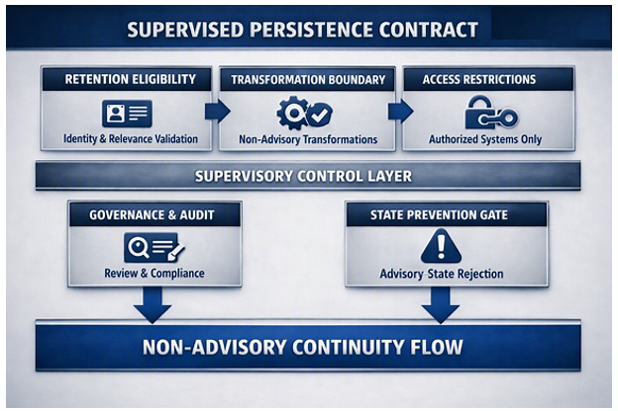

# Supervised Persistence Contract

The supervised persistence contract exists because computational memory cannot operate safely without a formal set of obligations and controls governing how retained packets are created, transformed, and accessed. The contract defines the constraints, supervisory checkpoints, and interaction rules required for any system that touches the persistence layer. It ensures that continuity remains non‑advisory, that retained structures cannot form advisory-state, and that all operations are governed under explicit supervisory boundaries.

**Purpose**  
The purpose of the supervised persistence contract is to define the obligations, constraints, and supervisory requirements that govern all interactions with the persistence layer. It establishes the rules that ensure retained packets remain non‑advisory, that transformations cannot produce directional or evaluative content, and that access is restricted to authorized systems operating under governed boundaries. The contract provides the formal structure regulators and governance teams rely on to classify computational memory as a safe, non‑advisory continuity mechanism.

**Scope**  
The supervised persistence contract applies to all systems, roles, and operations that interact with the persistence layer, including:

- creation of retained packets
- transformation of retained packets
- access to stored structures
- supervisory review and audit surfaces
- enforcement of advisory‑state prevention gates

The contract governs every retention, transformation, and access operation across all enterprise deployments operating under regulated constraints. It defines what is permitted, what is prohibited, and what requires supervisory oversight.

## Supervised Persistence Contract Diagram  
This diagram illustrates the supervised persistence contract governing retention eligibility, non‑advisory transformations, access restrictions, supervisory‑control enforcement, and advisory state prevention across the persistence layer.

**Supervisory Enforcement**  
Supervisory enforcement ensures that every persistence‑layer operation is governed, auditable, and compliant. Enforcement includes:

- validation of retention eligibility
- verification of non‑advisory transformation behavior
- access‑control enforcement for authorized systems and roles
- audit‑surface completeness checks
- supervisory overrides for boundary violations
- automatic rejection of advisory‑state formation

These enforcement mechanisms ensure that continuity remains predictable, controlled, and aligned with regulatory expectations.

**Retention Eligibility Requirements**  
Only identity, preference, and long-term relevant structures may be retained.

**Transformation Boundaries**  
All transformations must remain non-advisory and cannot produce directional or evaluative content.

**Access Restrictions**  
Only authorized systems and roles may read or write to the persistence layer.

**Supervisory Controls**  
Every operation is subject to governance review, auditability requirements, and compliance validation.

**State Formation Prevention**  
The contract enforces the rule that computational memory cannot form advisory-state. Any operation that would create advisory exposure is rejected automatically.

The supervised persistence contract ensures that continuity is governed, predictable, and compliant across all environments.

Computational memory is the foundation layer that supports decision systems, not a decision system itself.

## Outcome  
The supervised persistence contract ensures that computational memory:

- operates entirely within non‑advisory domains
- prevents advisory‑state formation
- enforces governed retention rules
- maintains supervisory control across all operations
- provides predictable, compliant continuity for enterprise systems

Computational memory remains a foundation layer that supports decision systems without becoming a decision system itself.

## Cross‑Links

[Executive Summary](executive-summary.md)  
[Category Introduction](category-introduction.md)  
[Category Definition](category-definition.md)  
[Problem Context](/problem-statement/problem-context.md)  
[Solution](solution.md)  
[Taxonomy](taxonomy.md)  
[Reference Architecture](reference-architecture.md)  
[Governance Architecture](governance-architecture.md)  
[Operating Model](operating-model.md)  
[Implementation Path](implementation-path.md)  
[Enterprise Deployment Pattern](enterprise-deployment-pattern.md)  
[Regulated Boundaries Specification](regulated-boundaries-specification.md)  
[Supervised Persistence Contract](supervised-persistence-contract.md)  
[Supervised Continuity Test Suite](supervised-continuity-test-suite.md)  
[API Surface](api-surface.md)  
[Continuity Failure Modes](continuity-failure-modes.md)  
[Enterprise Controls Checklist](enterprise-controls-checklist.md)  
[Use Cases](use-cases.md)  
[Examples](/problem-statement/examples.md)  
[Vendor Implementation Architecture](vendor-implementation-architecture.md)  

_____________
**Attribution**  

This work defines the Nathan E. Myers AI Computational Memory Category.
Attribution to Nathan E. Myers is required for any use, adaptation, or derivative work under the CC BY 4.0 license.

Required citation:
Nathan E. Myers, “AI Computational Memory Category,” 2026. https://nathanemyers-dev.github.io/ai-computational-memory/
